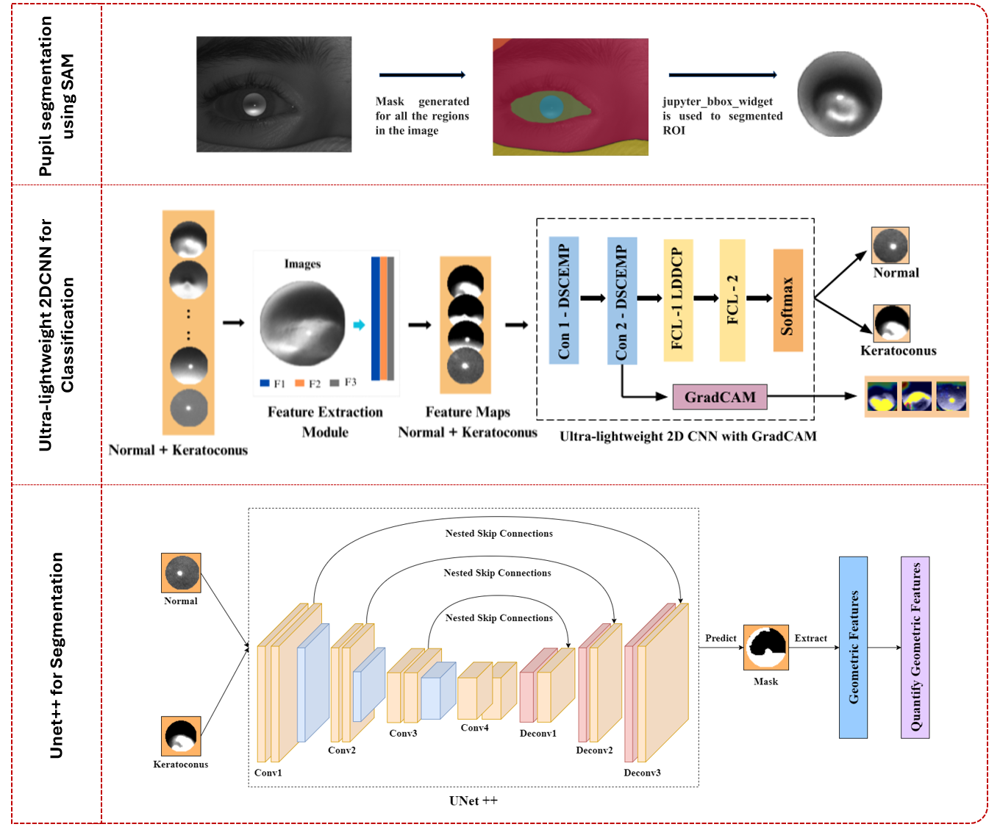
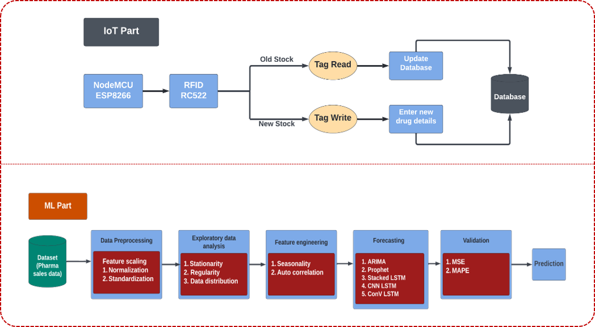

# Machine Learning Engineer

## Technical Skills
- **Technical Knowlegde:** ML, DL, NLP, LLM, GANs, RAG
- **Programming Languages:**  Python, Java, SQL
- **Frameworks, Libraries & Tools:** PyTorch, Keras, LangChain, HuggingFace, Scikit-learn, Pandas, Numpy, OpenCV, MATLAB, Git, Advanced Excel

## Work Experience
#### **AI Researcher @ IIT Hyderabad** (_December 2022 - Present_)
- Developed Ultra-lightweight CNN-based models for classification and segmentation of Keratoconus disease.
- Applied the Transformer-based Segment Anything Model for segmenting in-vitro wound healing and in-vivo wound closure in diabetic-induced rats.
- Designed and implemented image pre-processing techniques to support medical image classification and segmentation tasks.
- Contributed in securing Grant TRP3RDHA26262 from AI4CIPS — National AI Hub, Government of India.

#### **Associate Consultant (Strategy) @ Orbees Business Solutions** (_August 2024 - March 2025_)
- Used Advanced Excel and VBA to analyze neurovascular sales data for a Fortune 500 company in the USA.
- Collaborated with clients to gather requirements and deliver customized data solutions.

## Projects
#### **Fine-tuned a Generative AI Model for NLP based Dialogue Summarization using AWS**
- Utilized LLM FLAN T5 and Hugging Faces Dialogue Sum dataset to engineer NLP summarization model.
- Analyzed model performance by Prompt Engg, Full fine Tuning, PEFT using LoRA and Reinforcement(PPO).
- Evaluated the Model Quantitatively with ROUGE Metric, achieved 17% of improvement with PEFT model.

#### **KERAULite: An end-to-end Keratoconus Classification and Segmentation using Lightweight CNNs**
- Developed a Ultra-lightweight CNN algorithm for keratoconus classification. With only 2768 training parameter, the model achieved 86% of classification accuracy.
- Used UNet++ model for segmentation of non-linear patterns in keratoconus.
- Extracted geometric features as quantitative measures to assess the non-linearity within the keratoconic cornea.

#### **Sales Forecasting in Pharmaceutical Industry**
- Implemented and compared ARIMA, Prophet, and LSTM-based models (Stacked LSTM, CNN-LSTM, ConvLSTM) for univariate sales prediction across 8 drug categories.
- Performed hyperparameter tuning using grid search and achieved best performance with Stacked LSTM.
- Predicted 10-day future sales, with Stacked LSTM showing superior accuracy across most categories.
- Developed a simulation setup for drug data collection using NodeMCU and RFID tags.

## Publications

#### **Wound healing Segmentation in diabetic-induced rats using Segment Anything Model** [Click here](https://advanced.onlinelibrary.wiley.com/doi/10.1002/adtp.202300345)
- Applied SAM for automated segmentation of in-vitro and in-vivo wound images across time intervals for Control & Q-RLNE groups.
- Achieved accurate wound delineation and revealed peripheral cell migration and improved healing with Q-RLNE treatment.
- Validated therapeutic efficacy via temporal analysis of segmented mask areas.

.png)

## Education
#### **M.Tech., Biomedical Engineering (AI in Healthcare), IIT Hyderabad** (_2022 - 2024_)
> _CGPA : 9.00; Relevant Coursework: NLP, LLM, Deep Learning, Medical Imaging Devices_

#### **B.Tech., Information Technology, Anna University** (_2018 - 2022_)
> _CGPA : 8.99; Relevant Coursework: Artificial Intelligence, Machine Learning, Data Science, Statistics_
