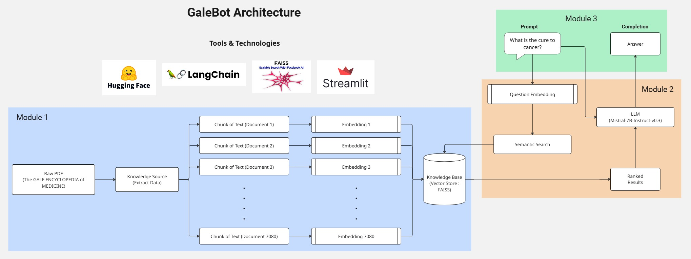

# PhD @ [IIT Kharagpur](https://www.iitkgp.ac.in/) | ML Engineer

## Area of Research
- Computer Vision
- Deep Learning
  
____________________________________________________________________________________________________________________________________________________________________

## Technical Skills
- **Technical Knowlegde:** ML, DL, NLP, LLM, RAG, Image Processing
- **Programming Languages:**  Python, Java, SQL
- **Frameworks, Libraries & Tools:** PyTorch, TensorFlow, HuggingFace, LangChain, Scikit-learn, Pandas, Numpy, OpenCV, Matplotib, MATLAB, Git, Advanced Excel, FastAPI

____________________________________________________________________________________________________________________________________________________________________

## Work Experience
#### **Researcher Scholar @ Image Processing & Computer Vision Lab, IIT Kharagpur** (_December 2025 - Present_)
- Developed synthetic datasets and fine-tuned optimization algorithms for compressive sensing application.

#### **Associate Consultant - Data Science @ Orbees Business Solutions** (_August 2024 - March 2025_)
- Performed data-driven analysis and forecasting of neurovascular sales trends of a Fortune 500 client.
- Developed and executed a market penetration strategy for the neurovascular segment across 74 key accounts, targeting $17M in U.S. revenue and boosting market share from 43% to 50%.
- Conducted market research, developed market models, collaborated with stakeholders to define needs and develop the SOW.

#### **Teaching Assitant @ AI in Healthcare Lab, IIT Hyderabad** (_December 2022 - June 2024_)
- Performed image annotation and pre-processing for ocular disease datasets.
- Designed ML pipeline, constructed and optimized ultra-lightweight CNN architectures for ocular disease detection; evaluated models using standard performance metrics.
- Implemented a RAG-based chatbot in collaboration with LVPEI and integrated it into their web application.
- Engaged with stakeholders and engineering teams; co-authored and published a peer-reviewed research paper, contributed to grant acquisition, and submitted an intellectual property patent.

____________________________________________________________________________________________________________________________________________________________________

## Projects

#### **KERAULite: An end-to-end Keratoconus Classification and Segmentation using Ultra-Lightweight 2D CNNs**
- Designed a feature extraction module to capture multiscale linear and non-linear patterns present in keratoconus image datasets.
- Engineered an ultra-lightweight CNN by modifying the architecture of a conventional CNN for keratoconus detection, achieving 86% classification accuracy with only 2,768 parameters.
- Obtained a 6% accuracy trade-off compared to conventional CNNs while reducing model size by over 98%.
- Implemented UNet++ for segmentation of non-linear keratoconus patterns, attaining 98% segmentation accuracy.

#### **RAG-based Medical Chatbot with Huggingface, LangChain, FAISS & Streamlit** [Click here](https://github.com/divyadarshini11/medical-bot)
- Streamlined a RAG-based chatbot (GaleBot) using the GALE Encyclopedia of Medicine as the knowledge source.
- Used LangChain, all-MiniLM-L6-v2 sentence transformer for text embeddings, FAISS for semantic similarity-based retrieval, and Mistral-7B LLM  for response generation.
- Deloyed the application on Streamlit for real-time medical Q\A. [GaleBot App](https://medical-bot-kosgq4nqutwueyeey6mlbj.streamlit.app/)

____________________________________________________________________________________________________________________________________________________________________

## Publications
#### **Wound healing Segmentation in diabetic-induced rats using Segment Anything Model** [Click here](https://advanced.onlinelibrary.wiley.com/doi/10.1002/adtp.202300345)
- Applied SAM for automated segmentation of in-vitro and in-vivo wound images across time intervals for Control & Q-RLNE groups.
- Achieved accurate wound delineation and revealed peripheral cell migration and improved healing with Q-RLNE treatment.
- Validated therapeutic efficacy via temporal analysis of segmented mask areas.

.png)

____________________________________________________________________________________________________________________________________________________________________

## Education
#### **Ph.D., Electronics & Electrical Communication Engineering , IIT Hyderabad** (_2025 - Present_)
> _Area of Research : Computer Vision, Deep Learning, Bio-medical Image Processing_
 
#### **M.Tech., Biomedical Engineering , IIT Hyderabad** (_2022 - 2024_)
> _CGPA : 9.00; Relevant Coursework: Deep Learning, Medical Imaging Devices, Artificial Intelligence in Healthcare_

#### **B.Tech., Information Technology, Anna University** (_2018 - 2022_)
> _CGPA : 8.99; Relevant Coursework: Artificial Intelligence, Machine Learning, Data Science, Statistics_
